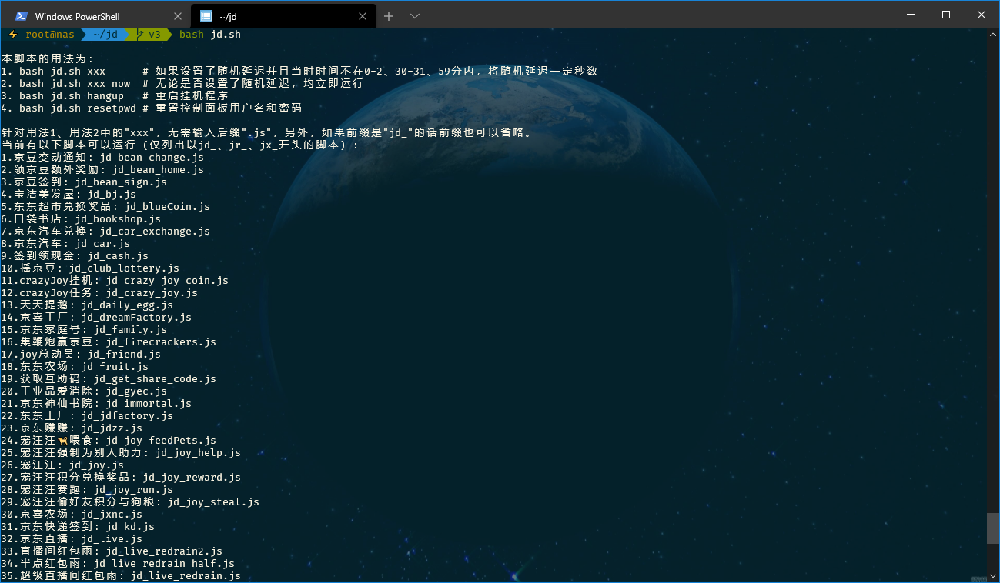
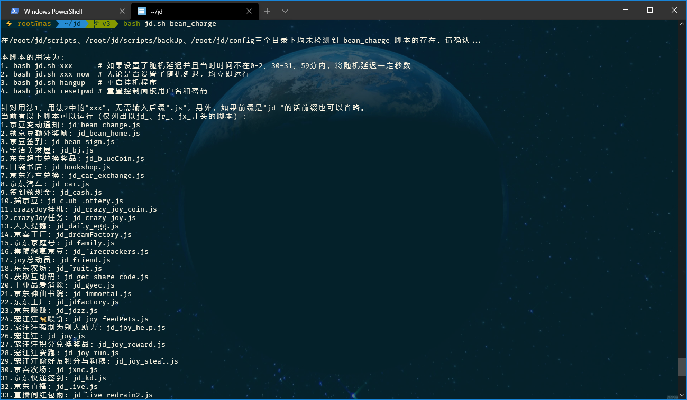
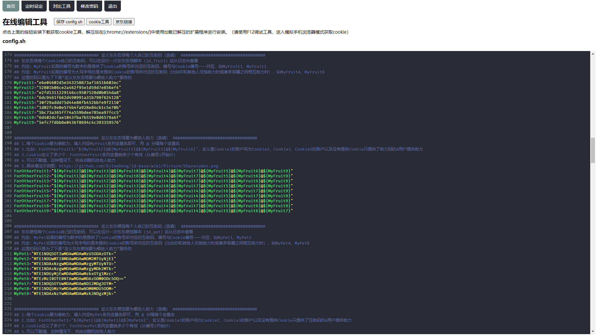
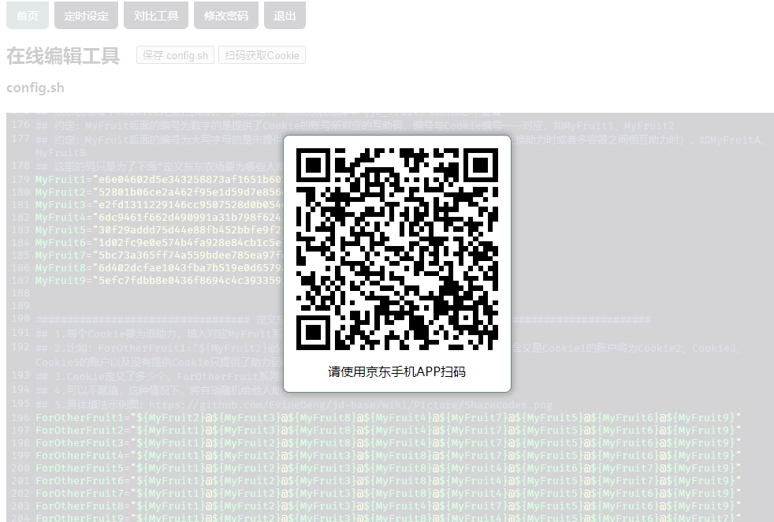
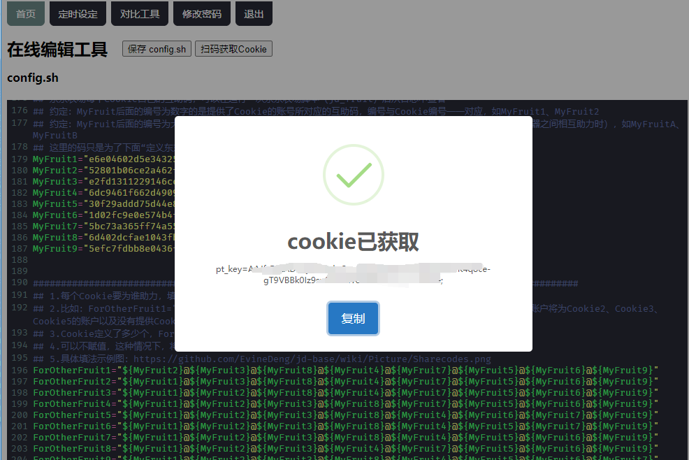
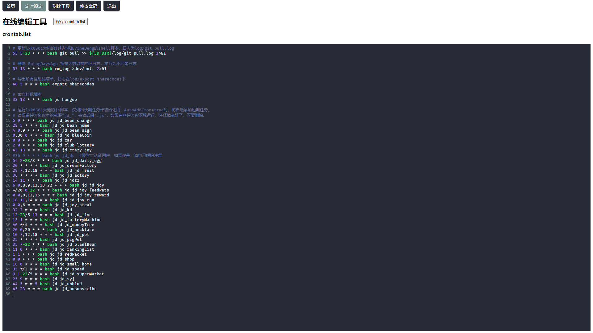
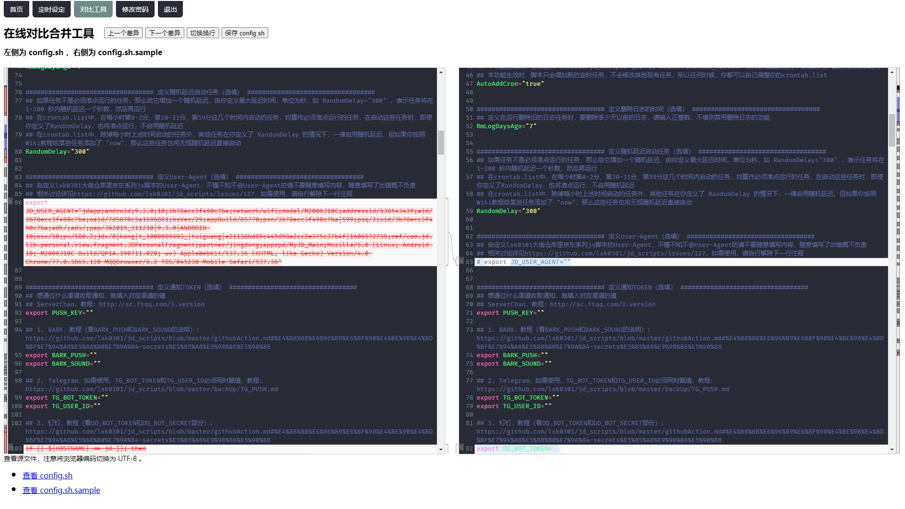
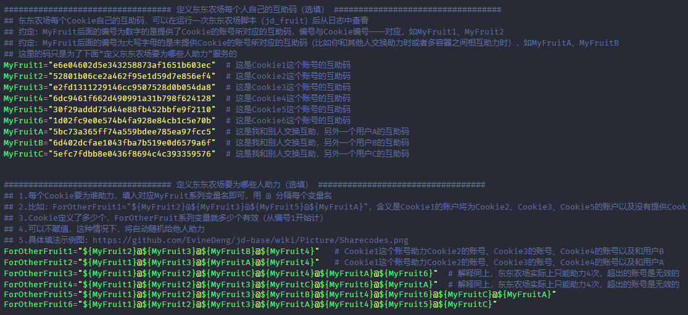

# 一、申明

- 本脚本的原作者为 EvineDeng。

- 本脚本用来运行 lxk0301/jd_scripts 中的 js 脚本，解放双手，自动玩耍京东的各种游戏，主要有：各种签到、东东农场、种豆得豆、天天加速、摇钱树、宠汪汪、东东萌宠、东东超市，获取各种小羊毛。

- 本脚本只是给 lxk0301 大佬的 js 脚本套了层壳。

# 二、如有帮助你薅到羊毛，请不吝赏杯茶水费给开发者


# 三、快速开始
## 1. Linux/MacOS
需要的依赖：`git wget curl perl moreutils nodejs npm` 请自行安装

**1. 以下全文均以此路径 `MY_PATH/jd` 进行举例，请自行修改为你自己的路径！**

**2. MY_PATH：进入你的目录后，执行 pwd 获取。**

**3. 需要多账号并发的，请建立多个账户，每个账户各自使用一套脚本。想要方便简单使用多账号并发的，请使用 Docker 的方式。**

1. 克隆本仓库

    ```shell
    cd MY_PATH && git clone -b v3 https://github.com/RikudouPatrickstar/jd-base jd
    ```

2. 复制并编辑自己的配置文件

    ```shell
    cd MY_PATH/jd

    # 创建一个配置文件保存目录
    mkdir config

    # 复制仓库下sample/config.sh.sample到config目录中，并命名为config.sh
    cp sample/config.sh.sample config/config.sh

    # 复制仓库下sample/computer.list.sample到config目录中，并命名为crontab.list
    cp sample/computer.list.sample config/crontab.list

    # 然后编辑这两个文件
    ```
    
    可以通过控制面板编辑，详见 [控制面板使用说明](#四web-面板使用说明) 。
    
    其中 `config.sh` 是配置文件，`crontab.list` 是定时任务清单，**如何编辑请查看两个文件内的注释，务必仔细阅读！**

    关于 `crontab.list`，这里说明一下，除了那些本来就会准时运行的脚本外，如果还有一些脚本你不想随机延迟，要么在 `config.sh` 中 `RandomDelay` 不要赋值(所有任务都将不延迟执行)，要么参考下文 [如何手动运行脚本](#如何手动运行脚本) 部分，在 `crontab.list` 中不想被随机延迟运行的任务后面，添加上 `now`，比如：
    
    ```shell
    20 * * * * bash MY_PATH/jd/jd.sh jd_dreamFactory now
    ```

3. 初始化

    **在首次编辑好 `config.sh` 和 `crontab.list` 后，请务必手动运行一次 `git_pull.sh`，不仅是为检查错误，也是为了运行一次 `npm install` 用以安装 js 指定的依赖。**

    ```shell
    bash git_pull.sh
    ```

    **针对首次运行 `git_pull.sh` **，出现类似以下字样才表示 `npm install` 运行成功：
    ```
    audited 205 packages in 3.784s

    11 packages are looking for funding
    run `npm fund` for details

    found 0 vulnerabilities
    ```

    如果 `npm install` 失败，请尝试手动运行，可按如下操作，如果失败，可运行多次：

    ```shell
    cd MY_PATH/jd/scripts

    # 如果只安装了npm
    npm install || npm install --registry=https://registry.npm.taobao.org

    # 如果安装了yarn
    yarn install
    ```

4. 添加定时任务

    **请注意：以下命令会完整覆盖你当前用户的 crontab 清单，请务必先按照 `crontab.list` 中的注释操作后再执行下面的命令！！！**

    ```shell
    cd MY_PATH/jd
    crontab config/crontab.list
    ```

5. 部署完成。

### 如何更新配置文件

`config.sh` 和 `crontab.list` 两个文件都一样，在任何时候改完保存好就行，其他啥也不用干，改完以后，新的任务就以新配置运行了。其中 `config.sh` 改完立即生效，`crontab.list` 会在下一次任何定时薅羊毛任务启动时更新。

如需要在线比对编辑，请参考：[控制面板使用说明](#四web-面板使用说明)

### 如何添加其他脚本

本环境基于 node，所以也只能跑 js 脚本。你可以把你的后缀为 `.js` 的脚本放在 `MY_PATH/jd/scripts` 下。比如你放了个 `test.js`，可以在你的 `crontab.list` 中添加如下的定时任务：

```shell
15 10 * * * bash MY_PATH/jd/jd.sh test     # 如果不需要准时运行或RandemDelay未设置
15 10 * * * bash MY_PATH/jd/jd.sh test now # 如果设置了RandemDelay但又需要它准时运行
```

然后运行一下 `crontab MY_PATH/jd/config/crontab.list` 更新定时任务即可。

**注意：在 crontab.list 中，你额外添加的任务不能以 “jd_”、“jr_”、“jx_” 开头，以 “jd_”、“jr_”、“jx_” 开头的任务如果不在 [jd_scripts](https://github.com/RikudouPatrickstar/jd_scripts) 这个仓库中，那么这个任务会被删除。**

如果你额外加的脚本要用到环境变量，直接在你的 `config.sh` 文件最下方按以下形式添加好变量即可（单引号或双引号均可）：

```shell
export 变量名1="变量值1"
export 变量名2="变量值2"
export 变量名3="变量值3"
```

### 如何手动运行脚本

1. 手动 git pull 更新脚本

    ```shell
    cd MY_PATH/jd
    bash git_pull.sh
    ```

2. 手动删除指定时间以前的旧日志

    ```shell
    cd MY_PATH/jd
    bash rm_log.sh
    ```

3. 手动导出所有互助码

    ```shell
    cd MY_PATH/jd
    bash export_sharecodes.sh
    ```

4. 手动启动挂机程序

    `cd` 到脚本目录后输入 `bash jd.sh hangup` 即可，然后挂机脚本就会一直运行。如果你希望每天终止旧的挂机进程，然后启动新的挂机进程，请参考 `sample/termux.list.sample` 中的挂机定时任务，添加到自己的 `crontab.list` 中。目前仅一个 `jd_crazy_joy_coin.js` 为挂机脚本。

5. 手动执行薅羊毛脚本，用法如下(其中 `xxx` 为 lxk0301 大佬的脚本名称)，不支持直接以 `node xxx.js` 命令运行：

    ```shell
    cd MY_PATH/jd
    bash jd.sh xxx      # 如果设置了随机延迟并且当时时间不在0-2、30-31、59分内，将随机延迟一定秒数
    bash jd.sh xxx now  # 无论是否设置了随机延迟，均立即运行
    ```

    如果你没输 lxk0301 大佬的脚本名称也不要紧，`jd.sh` 会提示你：

    

    如果 lxk0301 脚本名不记得也不要紧，输错了也会提示你的：

    

## 2. Docker
### 单个 Docker 容器
脚本一键部署：  
```shell
wget -q https://github.com/RikudouPatrickstar/jd-base/raw/v3/docker/onekey-docker.sh -O onekey-jd-docker.sh && chmod +x onekey-jd-docker.sh && ./onekey-jd-docker.sh
``` 

### Docker-Compose 多账户并发
需要先运行 make-image 脚本在本地生成一下镜像：
```shell
wget -q https://github.com/RikudouPatrickstar/jd-base/raw/v3/docker/make-image.sh && chmod +x make-image.sh && ./make-image.sh
```

[Docker 相关文件](https://github.com/RikudouPatrickstar/jd-base/tree/v3/docker) 已提供，自行研究使用，小白勿触！

## 四、Web 面板使用说明

下面内容是针对非 Docker 用户的，Docker 中这些流程都做好了，直接使用即可，请见 [Docker 部分](#2-docker)。

### 使用流程

1. cd 到本仓库脚本目录下。

2. 复制用户名和密码的配置文件到配置目录下。

    ```shell
    cp sample/auth.json config/auth.json
    ```

3. 进入本仓库下 panel 目录。

    ```shell
    cd panel
    ```

4. 安装依赖，npm 和 yarn 二选一。

   - 计算机：

    ```shell
    # 如果只安装了npm
    npm install || npm install --registry=https://registry.npm.taobao.org

    # 如果安装了yarn，可代替npm
    yarn install
    ```

5. 启动在线网页，根据需要二选一。

    ```shell
    # 1. 如需要编辑保存好就结束掉在线页面(保存好后按Ctrl+C结束)
    node server.js

    # 2. 如需一直后台运行，以方便随时在线编辑（两种方式二选一即可）
    # 2.1 nohup 方式
    nohup node server.js > /dev/null &

    # 2.2 pm2 方式
    npm install -g pm2    # npm和yarn二选一
    yarn global add pm2   # npm和yarn二选一
    pm2 start server.js
    ```

6. 访问 `http://<ip>:5678` 登陆、编辑并保存即可（初始用户名：`admin`，初始密码：`adminadmin`）。如无法访问，请从防火墙、端口转发、网络方面着手解决。

7. 如需要重置密码，cd 到本仓库的目录下输入 `bash jd.sh resetpwd`。

### 效果图











# 五、脚本可以干什么

## [git_pull.sh](git_pull.sh)

1. 自动更新 lxk0301 的京东薅羊毛脚本；

2. 自动更新我的 shell 脚本；

3. 自动删除失效的定时任务，并发送通知；

4. 自动添加新的定时任务，并发送通知；

5. 检测配置文件模板 `config.sh.sample` 是否升版，如有升版，发出通知；

6. 其他还有若干功能，查看 [git_pull.sh](git_pull.sh) 注释即可看到。

## [export_sharecodes.sh](export_sharecodes.sh)

从已经产生的日志中导出互助码，注意：是已经产生的日志。

## [rm_log.sh](rm_log.sh)

自动按设定天数（config.sh 中设置的）删除旧日志。

## [jd.sh](jd.sh)

自动按 crontab.list 设定的时间去跑各个薅羊毛脚本，需要后本脚本后面提供 js 脚本名称。

# 六、配置文件

## 助力次数

| 游戏 | 可助力他人次数 | 需要被助力次数 | 备注 |
| --- | :------------: | :-------: | --- |
| 东东农场 | 3                  | 5              |                                |
| 种豆得豆 | 3                  | 9              |                                |
| 东东萌宠 | 5                  | 5              |                                |
| 京喜工厂 | 3                  | 8+             | 需要被助力次数随等级提升而增加 |
| 东东工厂 | 3                  | 5              |                                |
| 京东赚赚 | 2                  | 5              |                                |
| 疯狂的JOY | 未知，请知道者补充 | 6              |                                |
| 京喜农场 | 3                  | 无上限         |                                |
| 口袋书店 | 未知，请知道者补充 | 10             |                                |
| 签到领现金 | 3                  | 40             |                                |
| 闪购抽盲盒 | 5                  | 10             |                                |

## 互助码填法

**互助码是填在 My 系列变量中的，ForOther 系统变量中只要填入 My 系列的变量名即可，按注释中的例子拼接，以东东农场为例，如下所示。**

**实际上东东农场一个账号只能给别人助力 3 次，我多写的话，只有前几个会被助力。但如果前面的账号获得的助力次数已经达到上限了，那么还是会尝试继续给余下的账号助力，所以多填也是有意义的。**

**ForOther 系列变量必须从1开始编号，依次编下去。**

```shell
################################## 定义东东农场互助（选填） ##################################
MyFruit1="e6e04602d5e343258873af1651b603ec"  # 这是 Cookie1 这个账号的互助码
MyFruit2="52801b06ce2a462f95e1d59d7e856ef4"  # 这是 Cookie2 这个账号的互助码
MyFruit3="e2fd1311229146cc9507528d0b054da8"  # 这是 Cookie3 这个账号的互助码
MyFruit4="6dc9461f662d490991a31b798f624128"  # 这是 Cookie4 这个账号的互助码
MyFruit5="30f29addd75d44e88fb452bbfe9f2110"  # 这是 Cookie5 这个账号的互助码
MyFruit6="1d02fc9e0e574b4fa928e84cb1c5e70b"  # 这是 Cookie6 这个账号的互助码
MyFruitA="5bc73a365ff74a559bdee785ea97fcc5"  # 这是我和别人交换互助，另外一个用户 A 的互助码
MyFruitB="6d402dcfae1043fba7b519e0d6579a6f"  # 这是我和别人交换互助，另外一个用户 B 的互助码
MyFruitC="5efc7fdbb8e0436f8694c4c393359576"  # 这是我和别人交换互助，另外一个用户 C 的互助码

ForOtherFruit1="${MyFruit2}@${MyFruitB}@${MyFruit4}"   # Cookie1 这个账号助力 Cookie2 的账号的账号、Cookie4 的账号以及用户 B
ForOtherFruit2="${MyFruit1}@${MyFruitA}@${MyFruit4}"   # Cookie2 这个账号助力 Cookie1 的账号的账号、Cookie4 的账号以及用户 A
ForOtherFruit3="${MyFruit1}@${MyFruit2}@${MyFruitC}@${MyFruit4}@${MyFruitA}@${MyFruit6}"  # 解释同上，东东农场实际上只能助力 3 次
ForOtherFruit4="${MyFruit1}@${MyFruit2}@${MyFruit3}@${MyFruitC}@${MyFruit6}@${MyFruitA}"  # 解释同上，东东农场实际上只能助力 3 次
ForOtherFruit5="${MyFruit1}@${MyFruit2}@${MyFruit3}@${MyFruitB}@${MyFruit4}@${MyFruit6}@${MyFruitC}@${MyFruitA}"
ForOtherFruit6="${MyFruit1}@${MyFruit2}@${MyFruit3}@${MyFruitA}@${MyFruit4}@${MyFruit5}@${MyFruitC}"
```



### 如何控制不同时间赋不同的值

```shell
## 时间
$(date "+%d") # 当前的日期，如：13
$(date "+%w") # 当前是星期几，如：3
$(date "+%H") # 当前的小时数，如：23
$(date "+%M") # 当前的分钟数，如：49

## 两个数字比较
-eq  # 前后两个数字相等
-ne  # 前后两个数字不等
-lt  # 前面数字小于后面数字
-le  # 前面数字小于或等于后面数字
-gt  # 前面数字大于后面数字
-ge  # 前面数字大于或等于后面数字
```

在 config.sh.sample 中其实已经给出过一个例子了，就是控制`东东萌宠是否静默运行`这个变量 `PET_NOTIFY_CONTROL`，示例如下：

```shell
if [ $(date "+%w") -eq 6 ] && [ $(date "+%H") -ge 9 ] && [ $(date "+%H") -lt 14 ]; then    # 如果当前是周六，当前小时数大于等于9并且小于14，则让东东萌宠发通知
  export PET_NOTIFY_CONTROL="false"
elif [ $(date "+%w") -eq 3 ] && [ $(date "+%H") -ge 9 ] && [ $(date "+%H") -lt 14 ]; then  # 如果当前是周三，当前小时数大于等于9并且小于14，则让东东萌宠发通知
  export PET_NOTIFY_CONTROL="false"
else
  export PET_NOTIFY_CONTROL="true"    # 其他非上述时间段时，通通不发通知
fi
```

在这里再额外给一些不同时间赋不同的具体例子：

1. 比如点点券（jd_necklace）的cron为`20 0,20 * * *`，每天0:20和20:20各运行一次，运行一次会发通知，但又不想收到通知，则可以在这两个时间点取消通知 TOKEN 的赋值（以钉钉为例）：


```shell
if [ $(date "+%H") -eq 0 ] && [ $(date "+%M") -eq 20 ]; then      # 点点券
  export DD_BOT_TOKEN=""
  export DD_BOT_SECRET=""
elif [ $(date "+%H") -eq 20 ] && [ $(date "+%M") -eq 20 ]; then   # 点点券
  export DD_BOT_TOKEN=""
  export DD_BOT_SECRET=""
else
  export DD_BOT_TOKEN="f8af60daa6a8ac99XXXXXXXXXXXXXXXXXXXXa07dbe10b4dbe324377bc"
  export DD_BOT_SECRET="SEC08db895aXXXXXXXXXX3acaeab76736e16cXXXXXXXXXX3412a4f36942aa905f76"
fi
```

2. 又比如想在报名宠汪汪赛跑时，调整 Cookie 顺序，让后面的账号先报名，前面的账号后报名，假如报名这一次的 cron 时间为 10:02，则可以：

```shell
if [ $(date "+%H") -eq 10 ] && [ $(date "+%M") -eq 2 ]
then  # 每天 10：02 报名宠汪汪赛跑时调整顺序
  Cookie8="pt_key=AAAAAAAAAAAAAAAAAAAAAAAAAAAAAAAAAAAAAAAAAAAAAAAAAAAAAAAAAAAAAAAAAAAAAAAAAAA;pt_pin=XXXXXXXX;"
  Cookie7="pt_key=BBBBBBBBBBBBBBBBBBBBBBBBBBBBBBBBBBBBBBBBBBBBBBBBBBBBBBBBBBBBBBBBBBBBBBBBBBB;pt_pin=XXXXXXXX;"
  Cookie5="pt_key=CCCCCCCCCCCCCCCCCCCCCCCCCCCCCCCCCCCCCCCCCCCCCCCCCCCCCCCCCCCCCCCCCCCCCCCCCCC;pt_pin=XXXXXXXX;"
  Cookie6="pt_key=DDDDDDDDDDDDDDDDDDDDDDDDDDDDDDDDDDDDDDDDDDDDDDDDDDDDDDDDDDDDDDDDDDDDDDDDDDD;pt_pin=XXXXXXXX;"
  Cookie1="pt_key=EEEEEEEEEEEEEEEEEEEEEEEEEEEEEEEEEEEEEEEEEEEEEEEEEEEEEEEEEEEEEEEEEEEEEEEEEEE;pt_pin=XXXXXXXX;"
  Cookie2="pt_key=FFFFFFFFFFFFFFFFFFFFFFFFFFFFFFFFFFFFFFFFFFFFFFFFFFFFFFFFFFFFFFFFFFFFFFFFFFF;pt_pin=XXXXXXXX;"
  Cookie3="pt_key=GGGGGGGGGGGGGGGGGGGGGGGGGGGGGGGGGGGGGGGGGGGGGGGGGGGGGGGGGGGGGGGGGGGGGGGGGGG;pt_pin=XXXXXXXX;"
  Cookie4="pt_key=HHHHHHHHHHHHHHHHHHHHHHHHHHHHHHHHHHHHHHHHHHHHHHHHHHHHHHHHHHHHHHHHHHHHHHHHHHH;pt_pin=XXXXXXXX;"
else
  Cookie1="pt_key=AAAAAAAAAAAAAAAAAAAAAAAAAAAAAAAAAAAAAAAAAAAAAAAAAAAAAAAAAAAAAAAAAAAAAAAAAAA;pt_pin=XXXXXXXX;"
  Cookie2="pt_key=BBBBBBBBBBBBBBBBBBBBBBBBBBBBBBBBBBBBBBBBBBBBBBBBBBBBBBBBBBBBBBBBBBBBBBBBBBB;pt_pin=XXXXXXXX;"
  Cookie3="pt_key=CCCCCCCCCCCCCCCCCCCCCCCCCCCCCCCCCCCCCCCCCCCCCCCCCCCCCCCCCCCCCCCCCCCCCCCCCCC;pt_pin=XXXXXXXX;"
  Cookie4="pt_key=DDDDDDDDDDDDDDDDDDDDDDDDDDDDDDDDDDDDDDDDDDDDDDDDDDDDDDDDDDDDDDDDDDDDDDDDDDD;pt_pin=XXXXXXXX;"
  Cookie5="pt_key=EEEEEEEEEEEEEEEEEEEEEEEEEEEEEEEEEEEEEEEEEEEEEEEEEEEEEEEEEEEEEEEEEEEEEEEEEEE;pt_pin=XXXXXXXX;"
  Cookie6="pt_key=FFFFFFFFFFFFFFFFFFFFFFFFFFFFFFFFFFFFFFFFFFFFFFFFFFFFFFFFFFFFFFFFFFFFFFFFFFF;pt_pin=XXXXXXXX;"
  Cookie7="pt_key=GGGGGGGGGGGGGGGGGGGGGGGGGGGGGGGGGGGGGGGGGGGGGGGGGGGGGGGGGGGGGGGGGGGGGGGGGGG;pt_pin=XXXXXXXX;"
  Cookie8="pt_key=HHHHHHHHHHHHHHHHHHHHHHHHHHHHHHHHHHHHHHHHHHHHHHHHHHHHHHHHHHHHHHHHHHHHHHHHHHH;pt_pin=XXXXXXXX;"
fi
```
    
### 日志相关

1. 日志报类似以下错误：
    ```
    TypeError: (intermediate value)(...).catch(...).finally is not a function
    at Object. (/home/bobotoy/jd/scripts/jd_bean_sign.js:52:13)
    at Module._compile (module.js:652:30)
    at Object.Module._extensions..js (module.js:663:10)
    at Module.load (module.js:565:32)
    at tryModuleLoad (module.js:505:12)
    at Function.Module._load (module.js:497:3)
    at Function.Module.runMain (module.js:693:10)
    at startup (bootstrap_node.js:188:16)
    at bootstrap_node.js:609:3
    ```
    首先，需要保证 Node.js 大版本 >=10，其次，在 >=10 的某些小版本也有此问题（你可以使用 `node -v` 或 `nodejs -v` 查看Node.js的版本），问题及详细的解决措施见 [nodejs/help#1877](https://github.com/nodejs/help/issues/1877)。

2. 日志报类似以下错误：
    ```
    (node:191) UnhandledPromiseRejectionWarning: Error: Cannot find module 'got'
    Require stack:
    - /jd/scripts/jd_bean_change.js
      at Function.Module._resolveFilename (internal/modules/cjs/loader.js:880:15)
      at Function.Module._load (internal/modules/cjs/loader.js:725:27)
      at Module.require (internal/modules/cjs/loader.js:952:19)
      at require (internal/modules/cjs/helpers.js:88:18)
      at Object.initGotEnv (/jd/scripts/jd_bean_change.js:266:3667)
      at Object.post (/jd/scripts/jd_bean_change.js:266:5580)
      at /jd/scripts/jd_bean_change.js:150:7
      at new Promise (<anonymous>)
      at TotalBean (/jd/scripts/jd_bean_change.js:136:10)
      at /jd/scripts/jd_bean_change.js:61:13
      (Use `node --trace-warnings ...` to show where the warning was created)
      (node:191) UnhandledPromiseRejectionWarning: Unhandled promise rejection. This error originated either by throwing inside of an async function without a catch block, or by rejecting a promise which was not handled with .catch(). To terminate the node process on unhandled promise rejection, use the CLI flag `--unhandled-rejections=strict` (see https://nodejs.org/api/cli.html#cli_unhandled_rejections_mode). (rejection id: 1)
      (node:191) [DEP0018] DeprecationWarning: Unhandled promise rejections are deprecated. In the future, promise rejections that are not handled will terminate the Node.js process with a non-zero exit code.
    ```

    如果是 Docker，请运行 `docker exec -it jd bash git_pull`，仔细看输出日志，可运行多次直到不报错为止。

    如果是非 Docker，cd 到本仓库脚本目录后执行 `bash git_pull.sh`，仔细看输出日志，可运行多次直到不报错为止。

3. 日志能产生但一直是空的，两个解决办法：

    - 放弃使用 CentOS；

    - 回小学重新学习语文知识，学好再来仔细地读一遍 crontab.list 中的注释。

    请搞明白 PATH 的含义：[一文精通crontab](https://zhuanlan.zhihu.com/p/58719487)，重点阅读这一篇文章的 “环境变量问题” 这一章节，出现日志能产生但一直是空的这个问题绝对是 PATH 有问题导致的，请将这篇文件理解透后，再来更改你 crontab.list 的 PATH。注意：PATH 中，前面的路径比后面的路径优先级更高。
